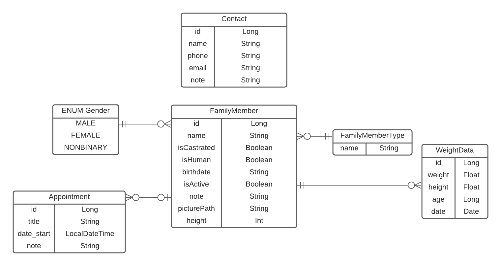

# FamilyCare: Ihre App für Oma, Opa, Kinder und Haustiere

## Dokumentation
Die Android App "Family Care" wurde als Gruppenprojekt im Rahmen der Veranstaltung "Programmierung mobiler Endgeräte" im Wintersemester 2021/22 an der FH Erfurt erstellt. Die Vorliegende Dokumentation wird ergänzt durch Kommentare im Code. Der Programmcode wurde komplett in Kotlin geschrieben.

### Testdaten

Bei Start der App wird als Beispiel-Familienmitglied Max Mustermann generiert. Von Max Mustermann liegen bereits 1000 Gewichts-Datensätze vor um die Funktion des Gewichtsverlaufs direkt nachvollziehen zu können. Darüber hinaus liegen für Max Mustermann 4 Termine vor, von denen zwei in der Vergangenheit und zwei in der Zukunft liegen. Dies dient der einfachen Testung der Filterfunktion in der Terminübersicht.

### Hinweise zu Installation und Ausführung

Unsere App unterstützt Android Geräte ab Android Version 29. \
Sie ist ohne weitere Einstellungen in Android Studio kompilierbar. Zur Ausführung werden keine weiteren Passwörter oder Logins benötigt.

### Allgemeine Projektübersicht

Projektteam

 

Das Team besteht aus 3 Mitgliedern, alle aus der Vertiefungsrichtung Ingenieursinformatik:

* **Antonio Blechschmidt** - [Profil](https://github.com/AntonioBlechschmidt)
* **Martin Kühlborn** - [Profil](https://github.com/KhbrnDev)
* **Daniel Michel** - [Profil](https://github.com/DanielMichel350)

Da wir alle gleichermaßen an allen Funktionalitäten der App beteiligt waren, sind hier keine einzelnen Verantwortlichkeiten angegeben.

Projektbeschreibung

Ziel des Projektes war eine App, die es Menschen ermöglicht, Daten von Familienmitgliedern, die sie betreuen, an einem zentralen Ort sammeln und verwalten zu können. Familienmitglieder können hierbei alle sein, die Teil der Familie sind, egal ob Hund, Meerschweinchen, Sohn, Oma oder jede andere Person und jedes andere Tier, für das der-die Nutzer-in Daten erfassen möchte.  

 

### Implementierte Funktionen und wo sie im Code zu finden sind

#### Hauptnavigation und MainActivity

Die Hauptnavigation erfolgt über ein Bottom-Nav Menü. Hierüber erreicht man die Eingangssichten dreier Bereiche. Die Hauptsicht, in der die App auch startet, ist über das mittlere Icon erreichbar und ist die Übersicht aller Familienmitglieder. Über das Icon links erreicht man die Sicht aller Kontakte, über das Icon rechts die Sicht aller Termine.

Die Hauptnavigation ist unter dem Pfad src/main/res/menu/bottom_nav_menu.xml konfigurierbar. 

Die App verfügt über genau eine Activity, die MainActivity. Sie ist unter src/main/java/de/fhe/familycare/view/core/MainActivity.kt zu finden. 

Bereich Familienmitglieder

##### Hauptsicht
In der Hauptsicht des Familienmitgliederbereiches werden alle aktiven Familienmitglieder als dynamische Liste durch Recycler View angezeigt. Klickt man auf die einzelnen Listenelemente des RecyclerViews wird man zu der Sicht des eizelnen Familienmitglieds navigiert. Neu erstellte Familienmitglieder sind standardmäßig aktiv und so lange aktiv, wie sie nicht aktiv archiviert wurden. Um auch auf archivierte Familienmitglieder zugreifen zu können, befindet sich direkt über dem RecyclerView ein Switch. Ist dieser aktiviert, werden im RecyclerView alle Familienmitglieder angezeigt, auch die archivierten. Noch über dem Switch befindet sich ein Button, mit dem neue Familienmitglieder erstellt werden können.  
Zu dieser Sicht gehöriger Code ist im Ordner src/main/java/de/fhe/familycare/view/familymember/allfamilymembers zu finden.   Das zugehörige LayoutFile ist src/main/res/layout/rvitem_all_familymembers.xml. 

##### Erstellen eines Familienmitglieds
Um Daten von Familienmitgliedern erfassen zu können, können Familienmitglieder erstellt werden. Zum Erstellen eines Familienmitgliedes muss ein Name, ein Geburtsdatum und ein Geschlecht [zur Auswahl stehen weiblich, männlich und nicht-binär] angegeben werden. Darüber hinaus muss angegeben werden, ob das Familienmitglied kastriert ist und ob es menschlich ist. Um zu vermeiden, dass das Erbe weiter geteilt werden muss, wurde hier die Möglichkeit, Opa kastrieren zu lassen, bewusst offen gelassen.
Falls ausgewählt wurde, dass es sich um ein menschliches Familienmitglied handelt, kann die Größe (in cm) des menschlichen Familienmitglieds erfasst werden. Bei allen Familienmitgliedern kann dem Familienmitglied ein Typ zugeordnet werden. Die Typen sind von dem-der Nutzer-in frei erstellbar, um hier maximale Flexibilität zu ermöglichen. Es ist auch möglich, keinen Typ anzugeben. Darüber hinaus kann bei jedem Familienmitglied auch eine Notiz hinterlegt werden, um eventuell gewünschte weitere Informationen zu dem Familienmitglied erfassen zu können. Auch ein Profilbild kann für jedes Familienmitglied hinterlegt werden. Dieses kann entweder durch Zugriff aus die Kamera neu erstellt werden oder ein bestehendes Foto aus der Galerie gewählt werden.  
Der zu dieser Sicht gehörende Code ist im Ordner src/main/java/de/fhe/familycare/view/familymember/addFamilyMember zu finden.  
Das zugehörige LayoutFile ist src/main/res/layout/fragment_add_family_member.xml.

##### Bereich der einzelnen Familienmitglieder
Die Bereiche der einzelnen Familienmitglieder sind als ViewPager realisiert mit drei Tabs.  
Das LayoutFile des ViewPagers ist src/main/res/layout/fragment_family_member_view_pager.xml.  
Der Complette zum ViewPager gehörige Code befindet sich im Ordner src/main/java/de/fhe/familycare/view/familymember/familyMemberViewPager.   
Im ersten Tab wird das Profil mit den aktuell gespeicherten Daten angezeigt. Hier befindet sich auch ein Button oben rechts, über den alle gespeicherten Daten geändert werden können. Da künstlich generierte Primärschlüssel in der Datenbank verwendet werden ist dies auch beim Namen möglich, gleichermaßen sind Namensdopplungen möglich. Die Sicht zum Editieren von Familienmitgliedern entspricht weitestgehend der zum Hinzufügen von Familienmitgliedern mit dem Unterschied, dass ein weiterer Switch existiert, mit dem das Familienmitglied archiviert werden kann bzw. ein archiviertes Familienmitglied wieder reaktiviert.   
Das zu diesem Tab gehörige LayoutFile ist src/main/res/layout/fragment_family_member.xml.  
Im zweiten Tab wird ein Gewichtsgraph angezeigt. Bei diesem haben wir auch das Anzeigen im Landscape Modus implementiert. Über ein Optionsmenü rechts oben kann ausgewählt werden, in welchem Intervall die Gewichtsdaten abgebildet werden sollen. Ausgewählt werden können täglich, wöchentlich, monatlich oder jährlich. Wurden in den angezeigten Zeiträumen mehrere Gewichtsdatensätze erfasst wird nur der erste angezeigt.
Ist das Familienmitglied menschlich und über 18 Jahre alt, wird unter dem Gewichtsgraph der BMI und eine Bewertung des BMIs angezeigt. Bei menschlichen Familienmitgliedern unter 18 Jahren wird stattdessen ein Hinweis eingenblendet, dass die Berechnung des BMIs erst ab 18 Erfolgt. Dies dient dem Schutz minderjähriger menschlicher Familienmitglieder davor, mit einem Maßstab gemessen zu werden, der für sie nicht gedacht ist.
Die Bewertung des BMIs wurde einer Tabelle der Barmer Krankenkasse entnommen, die unter folgendem Link erreichbar ist: https://www.barmer.de/gesundheit-verstehen/ernaehrungsgesundheit/body-mass-index/bmi-rechner-231560
Ganz unten in dieser Sicht wird ein Button eingeblendet, mit dem ein neuer Gewichtsdatensatz hinzu gefügt werden kann. Bei Betätigen des Buttons zum Hinzufügen eines Gewichts wird die Eingabe eines Gewichts in Kilogramm erbeten.Bei Speichern wird ein Gewichtsdatensatz erstellt, der neben dem eigegebenen Geiwcht auch die aktuelle Größe und das aktuelle Alter des Familienmitglieds mit abspeichert. Dies dient der Ermittlung des BMIs bei menschlichen Familienmitgliedern. 
Die LayoutFiles dieses Tabs sind im Ordner src/main/res/layout-land/fragment_weight_data.xml
src/main/res/layout/fragment_weight_data.xml zu finden.   
Unter dem dritten Tab ist eine auf das Familienmitglied zugeschnittene Terminsicht zu finden. Sie unterscheidet sich von der Haupt-Kalendersicht nur dadurch, dass sie nur Termine des jeweiligen Familienmitglieds anzeigt.

Bereich Kontakte

Der Code für diesen Bereich ist im Ordner src/main/java/de/fhe/familycare/view/contact zu finden. 

##### Hauptsicht 

Die Hauptsicht des Kontaktbereiches ist aufgebaut wie die Hauptsichten der anderen beiden Bereiche. Im unteren Bereich befindet sich eine dynamische RecyclerView Liste, in der die Kontakte der Familienmitglieder ausgegeben werden. Darüber findet sich ein Button zum Hinzufügen von neuen Kontakten. Per Klick auf die einzelnen Kontakte gelangt man in die Detailsicht des Kontakts. Ist bei den einzelnen Kontakten eine Telefonnummer hinterlegt wird im Item der RecyclerView Liste ein Telefon-Icon angezeigt. Mit Klick auf das Icon wird die Telefonfunktion des Smartphones mit der Telefonnummer geöffnet. Ist eine E-Mail-Adresse hinterlegt erscheint ein E-Mail Icon. Mit Klick auf das E-Mail Icon wird die Mail-App auf dem Smartphone geöffnet.   
Das LayoutFile für diese Sicht ist src/main/res/layout/fragment_all_contacts.xml.

##### Hinzufügen von Kontakten
Zum Hinzufügen von Kontakten muss ein Name vergeben werden. Darüber hinaus kann eine Telefonnummer und eine E-Mail Adresse angegeben werden. Auch hier gibt es ein Notizfeld um flexibel weitere Informationen hinterlegen zu können. 
Das LayoutFile für diese Sicht ist src/main/res/layout/fragment_add_contact.xml.

##### Detailsicht eines Kontaktes

In der Detailsicht werden die Informationen zum Kontakt angezeigt. Auch hier ist ein direktes Ansteuern von Telefon bzw. Mail-App über eingeblendete Buttons möglich. Darüber hinaus exisitert hier ein Button zum Bearbeiten des Kontaktes.
Das LayoutFile für diese Sicht ist src/main/res/layout/fragment_contact.xml.

##### Bearbeiten von Kontakten

Die Sicht zum Bearbeiten von Kontakten entspricht der zum Hinzufügen von Kontakten mit dem Unterschied, dass die bestehenden Daten des Kontakts beim Erstellen der Sicht vorgeladen werden und das oben Rechts ein Mülleimer-Icon erscheint, mit dem der Kontakt gelöscht werden kann.
Das LayoutFile für diese Sicht ist src/main/res/layout/fragment_edit_contact.xml.

Bereich Termine

Der Code für diesen Bereich ist im Ordner src/main/java/de/fhe/familycare/view/appointments zu finden.

##### Hauptsicht
Die Hauptsicht des Terminbereiches ist aufgebaut wie die Hauptsichten der anderen beiden Bereiche. Im unteren Bereich befindet sich eine dynamische RecyclerView Liste, in der die zukünftigen Termine aller Familienmitglieder ausgegeben werden. Darüber befindet sich ein Button zum Hinzufügen von neuen Terminen. Per Klick auf die einzelnen Termine gelangt man in die Detailsicht des Termins.
Das LayoutFile für diese Sicht ist src/main/res/layout/fragment_all_appointments.xml.

##### Hinzufügen von Terminen

Zum Hinzufügen von Terminen muss ein Titel vergeben werden sowie ein Datum und eine Uhrzeit, wobei im Falle der Nichtauswahl eines Datums und einer Uhrzeit das aktuelle Datum vorgeladen wird. Der Termin kann einem Familienmitglied zugeordnet werden und auch bei den Terminen kann eine Notiz hinzugefügt werden, wodurch flexibel weitere Informationen zum Termin gespeichert werden können. 
Die Auswahl von Termin und Uhrzeit erfolgt über einen DatePickerDialog mit einem anschließenden TimePickerDialog.
Das LayoutFile für diese Sicht ist src/main/res/layout/fragment_add_appointment.xml.

##### Detailsicht eines Termins

In der Detailsicht werden die gespeicherten Daten zum Termin angezeigt. Hier befindet sich außerdem ein Button um den Termin zu bearbeiten.
Das LayoutFile für diese Sicht ist src/main/res/layout/fragment_appointment.xml.

##### Bearbeiten von Terminen

Die Sicht zum Bearbeiten eines Termins entspricht der Sicht zum Hinzufügen eines Termins mit dem Unterschied, dass die bisherigen Daten des Termins beim Erstellen der Sicht vorgeladen werden und dass oben rechts ein Mülleimer-Icon eingeblendet wird, mit Hilfe dessen der Termin gelöscht werden kann. 
Das LayoutFile für diese Sicht ist src/main/res/layout/fragment_edit_appointment.xml.

 

### Datenstruktur

Die der App zugrunde liegende Datenstruktur ist in unten dargestelltem ER-Diagramm abgebildet. Wir haben uns dazu entschieden, die Kontakte unabhängig von den Familienmitgliedern zu verwalten, da es ohnehin oft zu Überschneidungen kommt. In der Regel wird man Oma, Opa und Onkel zum gleichen Hausarzt schicken und mit Hund, Katze und Igel den gleichen Tierarzt besuchen. Ein zentraler Tierarzt und ein zentraler Hausarzt-Kontakt ist also vollkommen ausreichend. 
Alle models, repositories, daos, enums und sonstiger Datenbank-bezogener Code ist im Ordner src/main/java/de/fhe/familycare/storage und seinen Unterordnern zu finden. 

Die Zentrale Tabelle der App ist ansonsten die der FamilyMembers. Die ID als PrimaryKey gewährleistet, dass alle sonstigen Attribute nicht eindeutig sein müssen und nach Belieben geändert werden können. Das Profilbild, die Notiz und die Größe des Familienmitglieds sind optionale Angaben, die restlichen Informationen müssen bei Erstellung des Familienmitgliedes angegeben werden. Jedes Familienmitglied braucht ein Geschlecht, zur Auswahl stehen männlich, weiblich und nicht binär. Auch ein FamilyMemberType ist bei jedem Familienmitglied anzugeben. Hier ist dem-der Nutzer-in maximale Flexibilität gegeben: Die FamilyMemberTypes sind ebenfalls als eigene Datenbanktabelle realisiert und beim Erstellen eines Familienmitgliedes kann entweder einer der bestehenden Typen ausgewählt werden oder ein komplett neuer Typ erstellt werden. Pro Familienmitglied können beliebig viele Gewichtsdaten erfasst werden, jedoch nur maximal eines pro Tag. Auch beliebig viele Termine pro Familienmitglied können erfasst werden. Darüber hinaus sind auch von Familienmitgliedern unabhängige Termine möglich. Ein denkbarer Use-Case für diese Funktion wäre beispielsweise ein Familienurlaub mit allen Familienmitgliedern gemeinsam. 

 

### Bekannte Bugs, spezielle Features und offene ToDos

#### Bekannte Bugs und Fehler

- Profilbilder, die beim Erstellen eines Familienmitglieds erstellt werden speichern direkt und nicht erst beim Speichern des Familienmitglieds
- Beim Diagramm der Gewichtsdaten wird bei der Anzeige von Wochen, Monaten und Jahren der erste Datensatz des Intervalls angezeigt, nicht der Durchschnitt aller vorhandenen Datensätze. Außerdem werden die Werte nicht mittig über den X-Achsen Labels angezeigt. Zudem wird bei der täglichen Ansicht ein Wert zu wenig ausgegeben.
- Sehr lange Namen (wie beispielsweise Daniel Justus Lian Michel) werden in manchen Sichten nicht schön angezeigt.

#### Spezielle Features und Hinweise
- Im Dropdown zum Erstellen von Terminen werden auch archivierte Familienmitglieder angezeigt um auch nach dem Tod Familienmitglied bezogene Termine - wie beispielsweise das Zahlen von Grabkosten - verwalten zu können. 
- Beim Anlegen des Familienmitgliedes wird das Geburtsdatum im Spinner angelegt wie von der Dokumentation empfohlen. Beim Editieren ist auch das Ändern des Geburtsdatums möglich, falls beim Anlegen ein Fehler passiert ist. Hier erfolgt das Ändern jedoch per DatePicker um ein versehentliches Ändern des Geburtsdatum beim Scrollen durch das Formular zu verhindern.
- Zur Verbesserung der Usability wird die Größe von Familienmitgliedern in cm eingegeben. Dies verhidert Verwirrungen, ob die Größe mit Punkt oder Komma angegeben wird. Sie wird im Familienmitglied als Integer gespeichert. Beim Übertragen in einen Gewichts-Datensatz wird die Größe jedoch in Meter umgewandelt und als Float gespeichert, da zur Berechnung des BMIs dieser Wert benötigt wird. 
- Alle Sichten, die potentiell den Rahmen eines gängigen Smartphones sprengen könnten, wurden scrollbar gemacht.
- Für alle, die immer wieder vergessen, welche ihrer Großeltern sie schon kastriert haben, kann auch diese Information von der App erfasst werden.

 

#### Offene ToDos und Verbesserungsmöglichkeiten

Wie bei jedem Projekt war die Zeit leider begrenzt und daher konnten wir nicht alle Funktionalitäten implementieren, die wir uns gewünscht hätten. Folgend sind Funktionen aufgelistet, die wir gerne noch implementiert hätten, wenn noch Zeit gewesen wäre:

- Verwalten von Medikamenten-Verabreichung: Den Nutzer-innen könnte die Möglichkeit gegeben werden, in der App zu notieren, welchen Familienmitgliedern sie wann welche Medikamente verabreichen müssen und sich über die App daran erinnern lassen.
- Quadratische Profilbilder: Gerne hätten wir die Profilbilder der Familienmitglieder quadratisch dargestellt. Wir standen jedoch vor dem Problem, dass das automatische Ausschneiden der Mitte bei Portraits nicht immer optimal ist. Um uns mit weiteren Möglichkeiten auseinander zu setzen hat leider die Zeit gefehlt.
- Zuordnen von Kontakten zu Familienmitgliedern in einer M:N Beziehung: Wir haben uns letztendlich dagegen entschieden, diese Funktionalität anzugehen, da Aufwand und Nutzen in keinem Verhältnis zueinander gestanden hätten.
- Wiederholung von Terminen: Ursprünglich hatten wir geplant, auch die Möglichkeit zu geben, wiederkehrende Termine einzustellen, wie zum Beispiel das wöchentliche Wiegen des Waschbären. 
- Wir verwenden beim WeightData Model den Typ Date zur Erfassung des Datums. Date ist deprecated, was wir jedoch zu spät realisiert haben, weshalb er bei Abgabe nach wie vor verwendet wird.
- Die Funktionen zur Auswahl von Datum und Uhrzeit beim Editieren und Hinzufügen von Terminen könnten ausgelagert werden, um doppelten Code zu reduzieren.
- Generell könnte man bei allen Fragmenten zum Hinzufügen und Editieren von Daten deutlich mehr Code wiederverwenden. 
- Zukünftig könnte auch DarkMode supportet werden, aktuell ist dies noch nicht der Fall.
- Wenn man beim Editieren oder Hinzufügen von Familienmitgliedern/Terminen/Kontakten auf zurück klickt könnte ein Dialog abfragen, ob man wirklich abbrechen möchte.
- Eine Funktion, Profilbilder auch im Vollbild anzeigen zu können, wäre praktisch.
- Bei Kontakten könnte neben Telefonnummer und Email-Adresse auch eine Adresse erfasst werden, die man sich dann auf Google Maps anzeigen lassen könnte.
